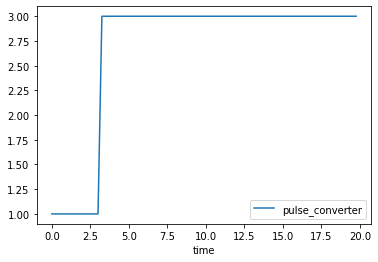

# Using the XMILE Compiler Standalone

The BPTK-Py package contains a compiler which compiles System Dynamics
models that use the XMILE format into Python code. This means that you
can compile models created with Stella, iThink or Vensim (via the XMILE
export) into Python code which will then run standalone.

The result of the compilation is a Python class that only depends on
NumPy and SciPy. This class contains the entire simulation model and it
can run "standalone", i.e you don't need the BPTK framework to actually
run the simulation and extract simulation results.

Running models standalone can be useful if want to run your model many
times with different initial setting, e.g. for machine learning
experiments. In such cases you don\'t need the extra functionality
provided by the frameworks `bptk` class and it is more efficent to work
with the raw simulation model.

To illustrate this, let\'s assume we have a small XMILE model called
`test_compiler.stmx` that lives in the `simulation_models` folder. The
model contains one converter called `pulse_converter` with the following
equation:

`1+PULSE(0.5,  3.25)`

Then all we need to convert the file into a python file
`test_compiler.py` is the following:

```python
from BPTK_Py.sdcompiler.compile import compile_xmile
src = "./simulation_models/test_compiler.stmx"
dest = "./simulation_models/test_compiler.py"
target = "py"

compile_xmile(src, dest, target)
```

The generated file contains everything you need to run the model, the
model itself is in a class `simulation_model`. That class contains a
number of generic methods that are needed for system dynamics
simulations, such as `simulation_model.delay` or
`simulation_model.random_with_seed`. These methods are always generated,
irrespective of whether your model actually uses them. This ensures that
all generated `simulation_model` classes have the same methods.

Your models equations themselves are stored in the class as a dictonary
of lambda functions. As our example model only contains one converter
called `pulse_converter`, our equations dictionary will also only
contain one such converter:

```python
from simulation_models.test_compiler import simulation_model
```

```python
model = simulation_model()
```

```python
model.equations
```

::: parsed-literal
{\'pulseConverter\': \<function
simulation_models.test_compiler.simulation_model.\_\_init\_\_.\<locals\>.\<lambda\>(t)\>}
:::

Because equations are Python Lambda functions that take time `t` as an
argument, we can call these functions directly:

```python
model.equations["pulseConverter"](5.25)
```

::: parsed-literal
3.0
:::

The `simulation_model` doesn't have any "convenience" functions to plot
the equations (because those functions are provided by the frameworks
`bptk` class).

But you can easily generate data into a pandas dataframe and then plot
that data using the dataframe's `plot()` method:

```python
from numpy import arange
data=[[x,model.equations["pulseConverter"](x)] for x in arange(0,20,0.25)] 
```

```python
import pandas as pd
df = pd.DataFrame(data,columns=["time","pulse_converter"])
df=df.set_index("time")
df[2:5] # just showing an interesting subset of data here
```

```{=html}
<div>
<style scoped>
    .dataframe tbody tr th:only-of-type {
        vertical-align: middle;
    }

    .dataframe tbody tr th {
        vertical-align: top;
    }

    .dataframe thead th {
        text-align: right;
    }
</style>
<table border="1" class="dataframe">
  <thead>
    <tr style="text-align: right;">
      <th></th>
      <th>pulse_converter</th>
    </tr>
    <tr>
      <th>time</th>
      <th></th>
    </tr>
  </thead>
  <tbody>
    <tr>
      <th>2.00</th>
      <td>1.0</td>
    </tr>
    <tr>
      <th>2.25</th>
      <td>1.0</td>
    </tr>
    <tr>
      <th>2.50</th>
      <td>1.0</td>
    </tr>
    <tr>
      <th>2.75</th>
      <td>1.0</td>
    </tr>
    <tr>
      <th>3.00</th>
      <td>1.0</td>
    </tr>
    <tr>
      <th>3.25</th>
      <td>3.0</td>
    </tr>
    <tr>
      <th>3.50</th>
      <td>3.0</td>
    </tr>
    <tr>
      <th>3.75</th>
      <td>3.0</td>
    </tr>
    <tr>
      <th>4.00</th>
      <td>3.0</td>
    </tr>
    <tr>
      <th>4.25</th>
      <td>3.0</td>
    </tr>
    <tr>
      <th>4.50</th>
      <td>3.0</td>
    </tr>
    <tr>
      <th>4.75</th>
      <td>3.0</td>
    </tr>
    <tr>
      <th>5.00</th>
      <td>3.0</td>
    </tr>
  </tbody>
</table>
</div>
```

```python
df.plot()
```

